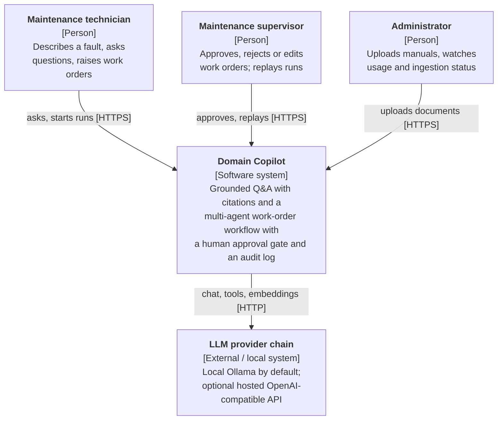
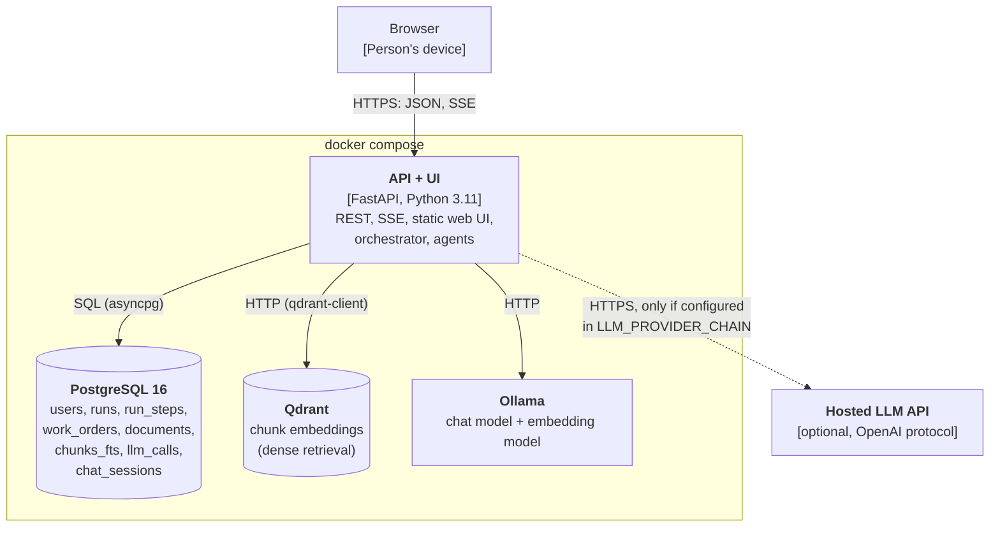
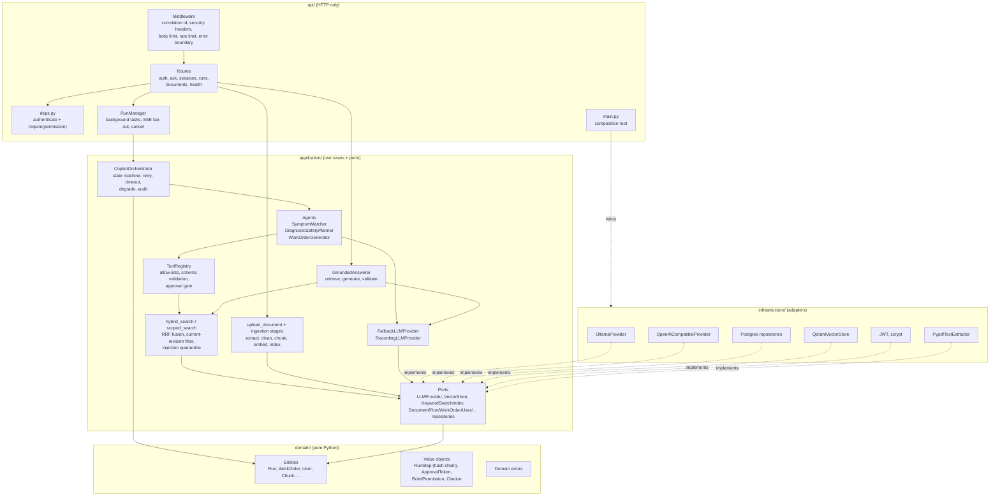
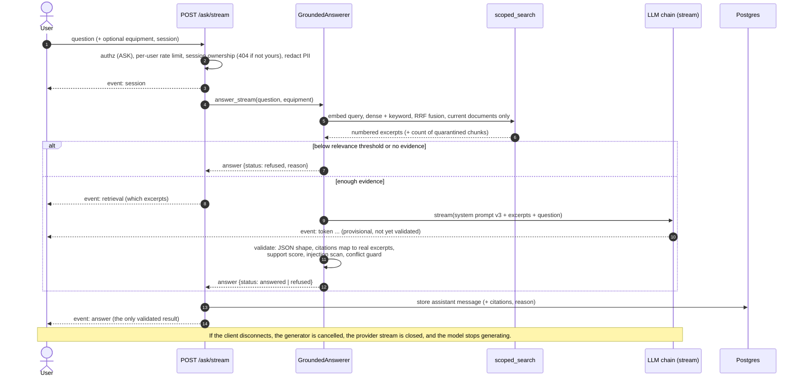
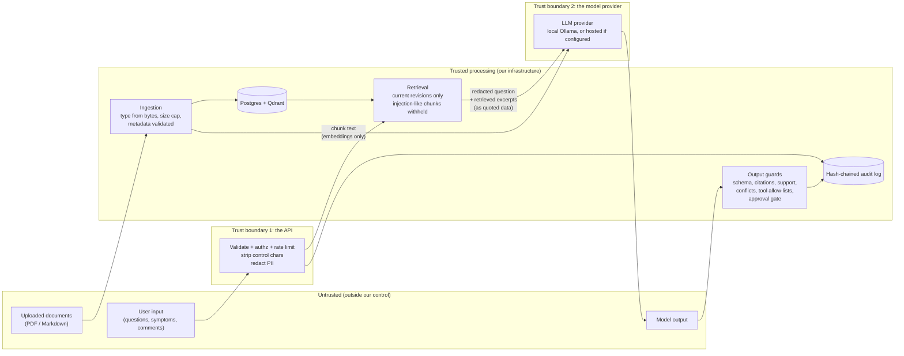
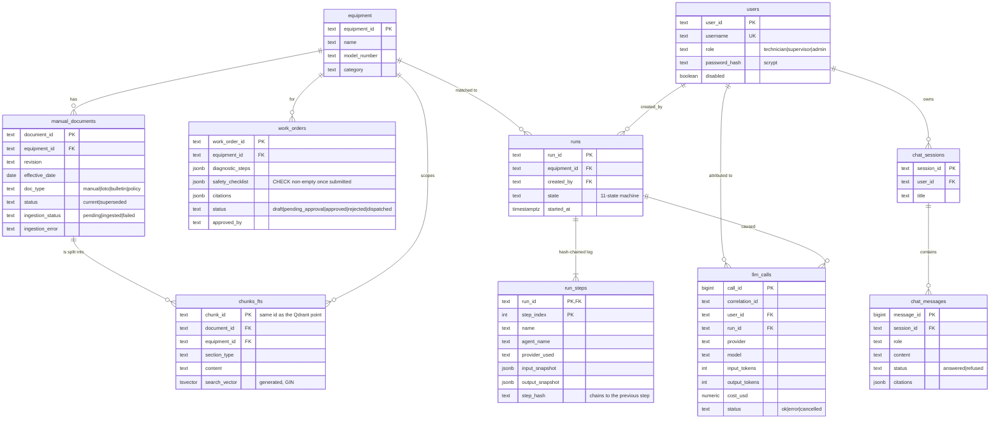
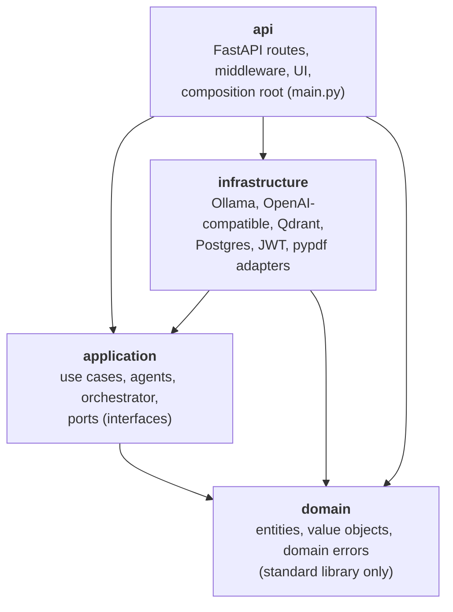
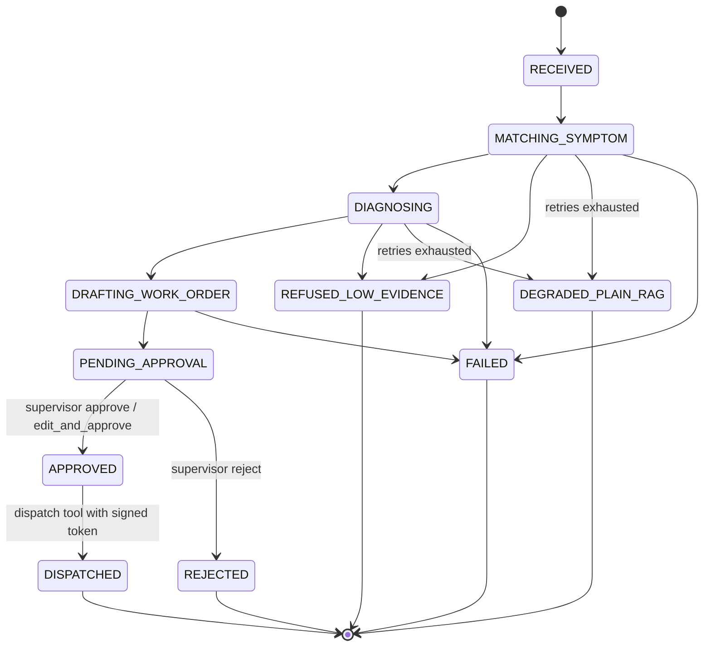

# Architecture

All diagrams are [Mermaid](https://mermaid.js.org) **source in this file**, so
they render on GitHub, diff in pull requests, and can be edited as text. Nothing
here is an exported image.

Contents: [1. C4 level 1](#1-c4-level-1--system-context) ·
[2. C4 level 2](#2-c4-level-2--containers) ·
[3. C4 level 3](#3-c4-level-3--components-of-the-api-container) ·
[4. Sequence: the agentic workflow](#4-sequence-the-agentic-workflow-with-the-approval-gate) ·
[5. Sequence: streaming a grounded answer](#5-sequence-a-streamed-grounded-answer) ·
[6. Data flow and trust boundaries](#6-data-flow-trust-boundaries-and-what-the-llm-provider-sees) ·
[7. ER diagram](#7-er-diagram) · [8. Layer dependencies](#8-layer-dependency-diagram) ·
[9. Run state machine](#9-run-state-machine) · [10. ADR index](#10-architecture-decision-records)

The variant is **D5 (industrial field maintenance) with twist T4 (audit and replay)**.
The business is a fictional furniture factory, *Dawlia Furniture Works*, in
Damietta. All documents are synthetic.

---

## 1. C4 level 1 — system context

Who uses the system and what it depends on.



## 2. C4 level 2 — containers

What runs, what it stores, and how the pieces talk. Everything except the
optional hosted provider starts with `docker compose up`.



Postgres holds both relational data and the **keyword side of hybrid search**
(`chunks_fts`, a generated `tsvector` with a GIN index). Qdrant holds the vectors.
Both are keyed by the same `chunk_id`, which is what lets rank fusion join them
([ADR-0004](adr/0004-vector-store-and-hybrid-retrieval.md)).

## 3. C4 level 3 — components of the API container



## 4. Sequence: the agentic workflow with the approval gate

`POST /runs` returns immediately; the workflow runs as a background task and
reports progress over SSE. Nothing is dispatched until a *different* human, a
supervisor, approves.

```mermaid
sequenceDiagram
    autonumber
    actor T as Technician
    actor S as Supervisor
    participant API as API (routes)
    participant RM as RunManager
    participant O as Orchestrator
    participant A as Agents (3)
    participant TR as ToolRegistry
    participant L as LLM chain
    participant DB as Postgres (runs, run_steps)

    T->>API: POST /runs {symptom}
    API->>API: authz (START_RUN), rate limit, strip control chars, redact PII
    API->>RM: submit(symptom, user)
    RM->>O: begin(created_by) -> run id
    O->>DB: save run (RECEIVED)
    API-->>T: 202 {run_id}
    T->>API: GET /runs/{id}/events (SSE)
    RM-->>T: step_started / step_finished ...

    par background task (correlation id + usage context copied from the request)
        RM->>O: execute(run, symptom)
        O->>DB: step "receive" (hash-chained)
        O->>A: 1. SymptomMatcher (timeout, retry with backoff)
        A->>L: complete(messages, tools)
        A->>TR: search_manual_chunks (allow-listed, schema-validated)
        TR-->>A: current-revision chunks only, injection-like chunks withheld
        A-->>O: typed EquipmentMatch
        O->>DB: step "match_symptom"
        O->>A: 2. DiagnosticSafetyPlanner
        A->>TR: get_safety_prerequisites (complete fetch, fails closed if truncated)
        A-->>O: typed DiagnosticPlan (safety list copied by code, not model output)
        O->>DB: step "diagnose"
        O->>A: 3. WorkOrderGenerator
        A->>TR: draft_work_order (side effect, ungated: creates a DRAFT only)
        A-->>O: typed WorkOrder draft
        O->>DB: step "draft_work_order"
        O->>DB: state PENDING_APPROVAL, step "await_approval"
        RM-->>T: awaiting_approval, stream_end
    end

    S->>API: GET /approvals
    API-->>S: queue with drafted work orders
    S->>API: POST /runs/{id}/decision {approve | reject | edit_and_approve}
    API->>API: authz (DECIDE), not the requester, redact comment
    API->>O: decide(run, reviewer, decision, edits)
    O->>DB: step "human_decision" (+ "reviewer_edit"); edits may add safety steps, never remove
    O->>TR: dispatch_work_order + HMAC ApprovalToken bound to this work order
    TR->>TR: verify signature, work order id, then execute
    O->>DB: step "dispatch", state DISPATCHED
    API-->>S: 200 dispatched

    Note over T,DB: Cancel: POST /runs/{id}/cancel cancels the asyncio task, the in-flight model call is abandoned, the run is closed as FAILED ("cancelled by client") and the log still verifies.
    Note over S,DB: Replay: GET /runs/{id}/replay verifies the hash chain first, then plays back stored steps. It never calls a model or a tool.
```

If a step fails after its retries the orchestrator degrades to a plain grounded
answer (`DEGRADED_PLAIN_RAG`); if evidence is missing or a safety prerequisite
cannot be established it ends in `REFUSED_LOW_EVIDENCE`. Both are recorded as steps.

## 5. Sequence: a streamed grounded answer



## 6. Data flow, trust boundaries, and what the LLM provider sees



**What crosses boundary 2.** With the default `LLM_PROVIDER_CHAIN=ollama`,
nothing leaves the machine. If a hosted provider is added to the chain:

| Sent to the provider | Never sent |
|---|---|
| The **redacted** question or symptom | User names, ids, roles, tokens |
| The system prompt (versioned file) | The database, other users' data, other sessions |
| Retrieved manual excerpts (the model needs them) | Approval decisions, reviewer comments |
| Tool results the agent requested (manual chunks, draft fields) | Secrets, the API key of any *other* provider |
| Chunk text at ingestion, for embeddings (only if the embedding provider is hosted; the default is local) | Run ids, correlation ids |

**Privilege separation.** Retrieved text is wrapped as quoted, numbered data
and any chunk resembling an instruction to an AI is withheld before it reaches the
prompt (`scoped_search`, `injection_scan`). The model never produces the safety
checklist or the approval; both are produced by code.

## 7. ER diagram



The vector store (Qdrant) is not in the ER diagram: it stores one point per chunk,
with the same `chunk_id` and the metadata fields used for filtering.

## 8. Layer dependency diagram

Arrows point from the depending layer to the layer it depends on. There is no
arrow from an inner layer to an outer one, and
[`tests/unit/test_architecture.py`](../tests/unit/test_architecture.py) fails the
build if one appears.



**How to verify the brief's swap test.** Adding a provider means one new file in
`infrastructure/llm/` implementing `LLMProvider`, one branch in
`infrastructure/llm/factory.py`, and an entry in `LLM_PROVIDER_CHAIN`. This was done
for real: the OpenAI-compatible adapter and the fallback chain were added after the
agents and orchestrator existed, and that change touched nothing in `domain/`. It did touch a small amount
of application plumbing (a `provider` field on `CompletionResult`, carried into the audit log's
`provider_used`), which is the honest measure of "configuration plus one adapter": the
business logic did not change, but observability had to learn which provider served a call.
Vector-store and embedding-model swaps follow the same
shape (`VectorStore` port; `EMBEDDING_PROVIDER` plus `OLLAMA_EMBED_MODEL`, with a
re-index and a recalibrated `RELEVANCE_THRESHOLD`, see `docs/EVALUATION.md`).

## 9. Run state machine



## 10. Architecture decision records

| ADR | Decision |
|---|---|
| [0001](adr/0001-clean-architecture.md) | Clean Architecture with ports and adapters |
| [0002](adr/0002-chunking-retrieval-strategy.md) | Structure-aware chunking; safety steps are atomic chunks |
| [0003](adr/0003-provider-abstraction.md) | One `LLMProvider` port for completion, streaming, tools and embeddings |
| [0004](adr/0004-vector-store-and-hybrid-retrieval.md) | Qdrant + Postgres full-text, fused with Reciprocal Rank Fusion |
| [0005](adr/0005-orchestration-pattern.md) | State-machine orchestration |
| [0006](adr/0006-audit-and-replay.md) | Replay from persisted state; hash-chained steps (the T4 decision) |
| [0007](adr/0007-provider-fallback-chain.md) | Ordered provider chain with a circuit breaker; embeddings never fail over |
