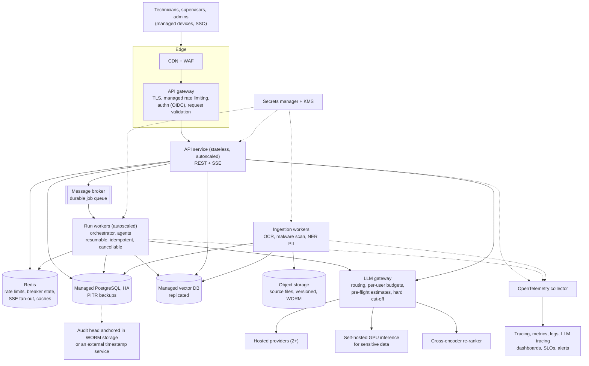
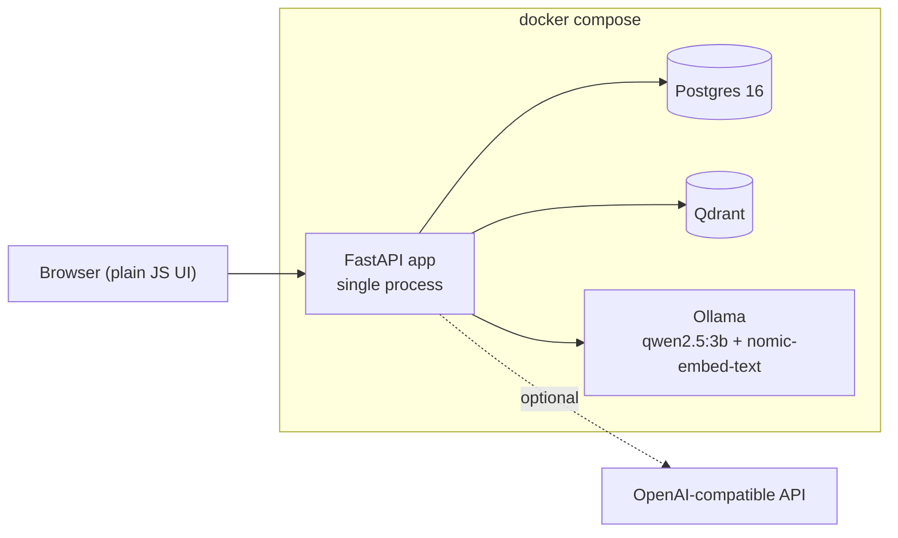

# System Design Document — Domain Copilot (D5T4)

This document has two parts, kept apart on purpose.

- **Part A** is the architecture I would build with no constraints on time, money or infrastructure.
- **Part B** is what is actually implemented, with a **gap table** that says, for every Part A
  component, whether it exists, why it was deferred, what protects the system in the meantime,
  and what it would cost to close. It also lists every significant design decision with the
  alternatives I rejected, and the choices I made under time pressure that I would not defend as good.

Part B's reasoning matters more than Part A's size. Companion documents:
[BRD](BRD.md) · [Architecture diagrams](ARCHITECTURE.md) · [Security](SECURITY.md) · [Evaluation](EVALUATION.md).

---

# Part A — Target architecture (unconstrained)

The product: cited question answering and a human-gated, multi-agent maintenance workflow for a factory with many
sites, thousands of documents, and hundreds of technicians.

## A.1 Shape

## A.2 Component by component

| Concern | Target | Why |
|---|---|---|
| Edge | CDN, WAF, managed API gateway with per-key and per-IP rate limiting | The top operational risk is abuse-driven token spend. Limits belong in front of the app and must be shared across replicas |
| Identity | OIDC single sign-on with MFA, short-lived tokens with refresh and a revocation list | No password handling in the app; joiners and leavers managed centrally |
| Compute | Stateless API pods, separate worker pool for runs, horizontal autoscaling on queue depth and request rate | Runs are slow and bursty; the API must stay responsive |
| Async jobs | Real broker and workers. Submission returns at once, progress is pushed, jobs survive restarts, resume from the last recorded step, are idempotent and cancellable | A restart must not strand a run. This is the brief's twist T7, and I would want it here too |
| Data | Managed PostgreSQL with high availability and point-in-time recovery; managed vector DB with replication; object storage for the original files with versioning and object lock | Source documents are evidence. Keep them, not just their chunks |
| Retrieval quality | Cross-encoder re-ranking, contextual chunk headers, query rewriting for terse technician wording, per-document-type retrieval tuning, a larger evaluation set | Retrieval was not my bottleneck at 30 documents; it will be at 3,000 |
| Models | An LLM gateway with two or more hosted providers plus self-hosted inference for data that must not leave. Per-user token budgets, budget-aware routing (cheap model for easy steps), pre-flight estimation, hard cut-off | Cost and residency are policy decisions; keep them out of business logic |
| Safety of content | Malware scanning, OCR with confidence handling, NER-based PII detection at ingestion and at request time, content-signing of approved manuals | The knowledge base is the largest injection surface |
| Audit | Hash-chained run log as now, plus the head hash anchored outside the database (object lock or a timestamping service), so even a database administrator cannot rewrite history undetected | A chain inside the same database proves consistency, not that the whole chain was not replaced |
| Observability | OpenTelemetry traces across API, workers and model calls; metrics; structured logs; LLM tracing (a self-hosted tool); dashboards and alerts on latency, error rate, refusal rate, cost per user | "Everything is observable" needs alerting, not only storage |
| Secrets | Secrets manager and KMS, rotation, no secrets in environment files | |
| CI/CD | Environments (dev, staging, production) from infrastructure-as-code; migrations as a gated job; progressive delivery; **an evaluation gate**: a change that lowers hit-rate, refusal correctness or injection resistance below thresholds cannot merge | The evaluation harness is the regression suite of a RAG system |
| Supply chain | SBOM, image signing, dependency and container scanning, pinned lockfiles, renovation bot | |
| Resilience | Multi-AZ, defined RPO and RTO, tested restores, chaos drills for provider outages | |
| Product | Multi-site tenancy, Arabic and English, mobile-first UI, offline reading of the last approved work orders, CMMS integration for dispatch | |

## A.3 Cost model at scale (illustrative; every input is an assumption)

Prices below are **placeholders**, not a quote. Hosted prices change and vary by model. The point is the shape of the calculation.

Assumptions: 500 technicians, 22 working days, 10 questions per technician per day, 1,100 workflow runs per month.
A question uses about 3,000 input tokens (system prompt, five excerpts, question) and 300 output tokens. A run makes about 8 model calls of about
3,000 input and 300 output tokens each. Assumed price for a small hosted model: 0.15 USD per million input tokens and 0.60 USD per million output tokens.

| Item | Volume per month | Tokens in / out | Cost |
|---|---|---|---|
| Questions | 110,000 | 330 M / 33 M | about 50 + 20 = **70 USD** |
| Workflow runs | 1,100 | 26 M / 2.6 M | about 4 + 1.6 = **6 USD** |
| Embeddings (queries, re-indexing) | | small | a few USD |

The model bill is tens of dollars a month at this scale. **The cost is elsewhere**: high-availability data stores, the gateway, observability, and
the people who keep the corpus current. Self-hosted GPUs pay for themselves only at much higher volume or when data residency demands them.
The lever that matters is not the token price. It is the false-refusal rate: every refused answerable question is a technician who goes back to
searching PDFs.

---

# Part B — Implemented MVP

## B.1 What exists

One container for the app, one each for Postgres, Qdrant and Ollama, started by `docker compose up`. Details are in [ARCHITECTURE.md](ARCHITECTURE.md).
What runs inside the app process:

- **Ingestion:** PDF and Markdown, staged (extract, clean, chunk, embed, index), idempotent, per-document status. Structure-aware chunking
  where every safety step and diagnostic item is atomic ([ADR-0002](adr/0002-chunking-retrieval-strategy.md)).
- **Retrieval:** Qdrant dense plus Postgres full-text, fused with Reciprocal Rank Fusion, scoped to current revisions and optionally one machine
  ([ADR-0004](adr/0004-vector-store-and-hybrid-retrieval.md)). The one enhancement is metadata filtering.
- **Answering:** relevance threshold, numbered-excerpt citations, a support check of the answer against its own citations, an injection scan, a
  conflict guard across documents, and refusal as a first-class result. Streams over SSE.
- **Workflow:** a state-machine orchestrator ([ADR-0005](adr/0005-orchestration-pattern.md)) running three agents with allow-listed tools and typed
  contracts, a hash-chained log ([ADR-0006](adr/0006-audit-and-replay.md)), an approval gate with a signed one-work-order token and separation of duties.
- **Providers:** Ollama and an OpenAI-compatible adapter behind one port, with a circuit-breaker fail-over chain ([ADR-0007](adr/0007-provider-fallback-chain.md)).
- **Access and safety:** JWT, three roles enforced on the server, PII redaction, rate limits, size caps, security headers, output token caps.
- **Evaluation:** 35 golden cases, 13 adversarial, with recorded baselines and failure analysis ([EVALUATION.md](EVALUATION.md)).

Verification in the repository: about 360 automated tests (the ones that need live services skip themselves when those are absent), CI on every pull request (build including the Docker image, lint, tests against a real Postgres,
dependency audit of the pinned lockfile, secret scan over the full history).

## B.2 Gap table

Effort is my estimate for one engineer. Costs are order-of-magnitude and depend on the provider.

| Target component | Implemented? | Why deferred | Interim mitigation | Effort and cost to close |
|---|---|---|---|---|
| Gateway with managed rate limiting | **Partial**: in-process token buckets (120 requests per minute per client address, 5 login attempts per minute per user and address, 20 questions or runs per minute per user) plus body-size caps | Abuse-driven token spend is my top operational risk, so I built the smallest control that addresses it and deferred the managed version | Output token cap per call, input length caps, per-user limits, usage view. **Known weaknesses:** it does not survive more than one replica, and behind a NAT every user shares one address for the coarse limit ([#20](https://github.com/SamerWaelElbehidy/domain-copilot/issues/20)) | About 4 h and a small managed Redis (roughly 15 USD per month) |
| SSO, MFA, token revocation | **No**: local accounts, scrypt hashes, HS256 JWT with a 60-minute life, the user's role and disabled flag re-read on every request | Not needed to demonstrate role-based control. Building an identity provider is the wrong use of the time | A disabled account or changed role takes effect on the next request even with a valid token. Secrets checked at startup outside development | About 2 days to integrate an OIDC provider; the provider is free to low cost |
| Secrets manager | **No**: environment variables | Compose-level project | The app refuses to start outside development with a default, placeholder or short `JWT_SECRET`; no secret is in the repository or its history (scanned) | About 3 h plus the provider's fee |
| Broker and durable workers | **No**: runs are asyncio tasks inside the API process | The brief lists this as a separate twist. The workflow is short (seconds to a minute on a local model) | Every step is persisted as it happens, so a crash leaves an accurate partial trace. **Known weakness: a run in progress when the process dies is left in a non-terminal state and is not resumed or cleaned up** | 1 to 2 days; broker cost small |
| Autoscaling, multiple replicas | **No** | Single site, few users | SSE progress fan-out and run cancellation are in process memory, so they work only against one replica | About 1 day once the broker exists |
| Caching | **No** | Latency is acceptable for the demo (3.8 to 4.5 s per question on the local model) | None | About 4 h |
| Managed vector database | **No**: Qdrant single container | Managed tier costs money, adds nothing for a 30-document corpus | Idempotent re-ingestion rebuilds it from the source | Hours; cost depends on size |
| Observability stack (OpenTelemetry, metrics, dashboards, alerts) | **Partial**: custom trace store: correlation id from request to run to each model call, per-call tokens, cost, latency and status in Postgres, per-run and per-user views, health and readiness endpoints, structured logs with the id | The brief accepts a clean custom trace store | Correlation id in every log line; `GET /runs/{id}/trace` | About 4 h for trace export ([#25](https://github.com/SamerWaelElbehidy/domain-copilot/issues/25)); about 1 day for dashboards and alerts |
| Cost accounting with real prices | **Partial**: tokens are recorded for every call; the price table for hosted models is empty by default, so cost shows as 0 unless configured | Local models cost nothing, and hosted prices change | Tokens are exact, so cost can be computed afterwards | About 1 h to add a configurable price map |
| CI/CD environments, IaC, deployment | **No**: CI on pull requests only | Optional in the brief | The image builds in CI; the compose file is the documented way to run | About 1 day ([#26](https://github.com/SamerWaelElbehidy/domain-copilot/issues/26)) |
| Backup and disaster recovery | **No**: Docker volumes | Demo scale | `docker compose down -v` plus re-ingest rebuilds knowledge; run logs would be lost | About half a day plus storage |
| Audit head anchored outside the database | **No** | Needs an external store | The chain detects edits to individual steps. It cannot detect a full rewrite by someone who can write to the database | About 4 h with object lock |
| Cross-encoder re-ranking, query rewriting | **No** | Retrieval hit-rate was 100% at top 5, so this would not fix the failures I measured | Metadata filtering | 1 day |
| NER-based PII detection | **No**: pattern-based redaction only (emails, Egyptian national ids and phone numbers, international phones, Luhn-valid cards) | Needs a model on the request path | Redaction before storage and before any model call; local model by default so nothing leaves | About 1 day ([#22](https://github.com/SamerWaelElbehidy/domain-copilot/issues/22)) |
| Arabic and OCR | **No** | Out of scope by decision (see the BRD) | Scans are rejected with a clear error; UI and corpus are English | 2 days and 1 day ([#23](https://github.com/SamerWaelElbehidy/domain-copilot/issues/23), [#24](https://github.com/SamerWaelElbehidy/domain-copilot/issues/24)) |
| Circuit-breaker state shared across replicas | **No** | Single replica | Each replica learns independently | About 3 h ([#21](https://github.com/SamerWaelElbehidy/domain-copilot/issues/21)) |
| A 150-page corpus | **Partial**: 30 documents (the floor), about 11,000 words | Writing realistic manuals is slow, and the brief lists corpus size as a permitted cut | Documents are realistic in structure (revisions, superseded manuals, LOTO cards, bulletins, policies, conflicting memos in the evaluation fixtures) | About 2 days for 150 pages of new synthetic material |
| Load and performance testing | **No** | | Rate limits and timeouts bound the damage | About 1 day |
| Browser end-to-end tests, accessibility review | **No** | The brief asks for plain and functional | API tests cover every endpoint the UI uses; static checks guard the content-security policy and unsafe markup sinks | About 1 day |

## B.3 Design decisions and the alternatives I rejected

| Decision | Chosen | Rejected, and why |
|---|---|---|
| Language and framework | Python 3.11 and FastAPI | **.NET or Java:** more ceremony for the same result and less readable to trainees who will learn from this. **Node:** weaker ecosystem for PDF parsing and evaluation tooling. Python is what the target audience reads |
| Architecture style | Clean Architecture, four layers, enforced by a test | **Vertical slices:** this system has few, deep, shared concerns (one retrieval pipeline, one contract format, one audit mechanism), so a shared kernel fits better ([ADR-0001](adr/0001-clean-architecture.md)) |
| Chunking | Structure-aware; safety and diagnostic items are atomic chunks | **Fixed-size windows:** can cut a safety step in half, or separate a qualifier from its value. **Sentence splitting:** same problem, worse ([ADR-0002](adr/0002-chunking-retrieval-strategy.md)) |
| Retrieval | Dense plus keyword, fused with Reciprocal Rank Fusion | **Dense only:** misses exact model numbers and codes. **Keyword only:** misses paraphrase. **Weighted score sum:** the two score scales are not comparable, so weights are guesses. RRF uses ranks only |
| Vector store | Qdrant, keyword side in Postgres full-text | **pgvector alone:** simpler, but I wanted the vector store to be swappable and demonstrably a separate adapter. **Elasticsearch:** another heavy service for a small corpus ([ADR-0004](adr/0004-vector-store-and-hybrid-retrieval.md)) |
| Orchestration | Explicit state machine | **Supervisor agent:** a model choosing the next agent makes the order, and so the safety path, non-deterministic. The workflow is fixed and known. **Free-form planner-executor:** same problem ([ADR-0005](adr/0005-orchestration-pattern.md)) |
| The twist, T4 | Replay from stored steps, hash-chained log | **Re-calling the model with the same prompts:** produces different output, so it replays the request, not the run ([ADR-0006](adr/0006-audit-and-replay.md)) |
| Approval enforcement | HMAC-signed token bound to one work order, verified inside the tool registry; the model never sees the gated tool | **A boolean "approved" argument:** a model or a caller could set it. **Gating in the route only:** an agent path could bypass it. **Gating every side effect:** `draft_work_order` only creates a draft and gating it would add clicks with no safety benefit |
| Safety checklist | Copied from the manual by code after a complete fetch that fails closed if truncated | **Asking the model to list them:** exactly the failure the brief names |
| Streaming | Server-sent events over `fetch` | **WebSocket:** two-way channel we do not need, harder to proxy. **`EventSource`:** cannot send an Authorization header |
| Background work | asyncio tasks in the API process | **Broker and workers:** the correct answer, deferred (gap table) |
| Provider abstraction | One port, two adapters, fail-over chain, embeddings never fail over | **A gateway product:** hides the failure semantics I wanted to show and test ([ADR-0007](adr/0007-provider-fallback-chain.md)). **Fail over embeddings:** silently corrupts retrieval |
| Authentication | JWT bearer, roles re-read every request | **Server sessions:** would need shared state. **Roles only in the token:** a demoted user keeps power until expiry |
| UI | Static HTML and plain JavaScript, no build step | **A framework:** more moving parts, and the brief says spend no time on visual design |
| Prompts | Versioned files in `prompts/`, loaded by name and version | **String literals:** cannot be diffed, reviewed or evaluated per version |
| Test doubles | In-memory fakes with real behaviour (vector store, keyword index, repositories, scripted LLM) | **Mock objects:** verify calls, not behaviour; break on refactor |
| Determinism | Temperature 0, fixed seed, pinned relevance threshold | **Default sampling:** the evaluation would change between runs and could not be compared |
| Evaluation of groundedness | Deterministic word-support check | **A second model as judge:** costs, drifts, and small local models judge poorly. Known limit: it cannot judge paraphrase or reasoning ([EVALUATION.md](EVALUATION.md), threats to validity) |

## B.4 Expedient or poor choices, stated plainly

These are the places where I would not defend the outcome as good engineering, only as acceptable for the time.

1. **Runs die with the process.** Background tasks live in the API process. A restart during a run leaves it non-terminal, with no resume and no cleanup job.
2. **The hosted-provider adapter has never talked to a real hosted API.** I had no key. It is tested against a mock HTTP transport that follows the documented
   protocol, including tool calls, streamed deltas and errors. Until someone runs it against a real host, treat it as verified against the specification, not against reality.
3. **The web UI has been checked with a syntax check, API tests and static checks for the content-security policy and unsafe markup, but I have not exercised it visually in a browser.**
4. **The relevance threshold (0.73) was calibrated on the same golden set the evaluation reports.** That flatters the numbers. The threat is stated in the evaluation, and the fix is a held-out set.
5. **Accuracy is 73% on answerable questions with the 3B model.** The guards keep it safe (no out-of-corpus answer, no injection leak), but roughly one in four answerable questions is refused.
   The honest summary is "safe and only moderately useful with a small local model".
6. **A migration bug reached `main`.** Migration 0008 re-added a column that 0006 had created. It was never applied because no test touched a database, and I caught it while reviewing
   my own change. CI now runs the migrations against a real Postgres and a static check rejects duplicate schema objects.
7. **The lockfile was generated on Windows and contained a Windows-only package.** CI's image build caught it.
8. **The compose file publishes Postgres, Qdrant and Ollama ports to the host without authentication,** for developer convenience. That is acceptable on a laptop and wrong on a server; see [SECURITY.md](SECURITY.md).
9. **The corpus is 30 short documents, about 11,000 words,** well under the 150-page target.

## B.5 What I would do first with another 40 hours

1. A broker and workers so runs survive restarts and can resume (removes weakness 1 and makes the design multi-replica).
2. A held-out evaluation set and a re-run of the calibration (removes weakness 4), then a larger corpus (weakness 9).
3. Run the hosted adapter against one real free-tier provider and record the result (weakness 2).
4. Anchor the audit head outside the database.
